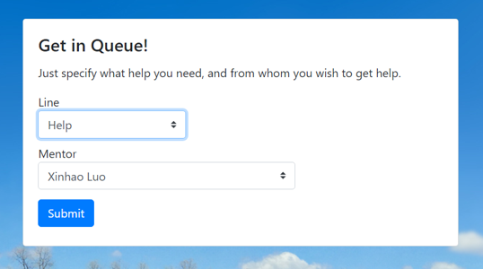
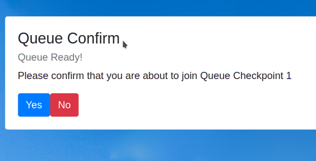
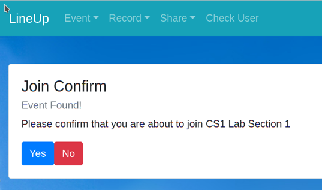

# Lineup

The way to wait in the line. (Ver Fall 2020, SD&D)

## Features

- Real-Time information
- Create and edit queued infromation
- online and interaction mode
- used by students and mentors

## Structure

### Backend

Powered by FastAPI, please refer to its own README.md for more info

### Frontend

Powered by Vuejs, please refer to its own README.md for more info.

## Setup

Please visit both `frontend` and `backend` README.md installation part

## Screenshots

## License

MIT